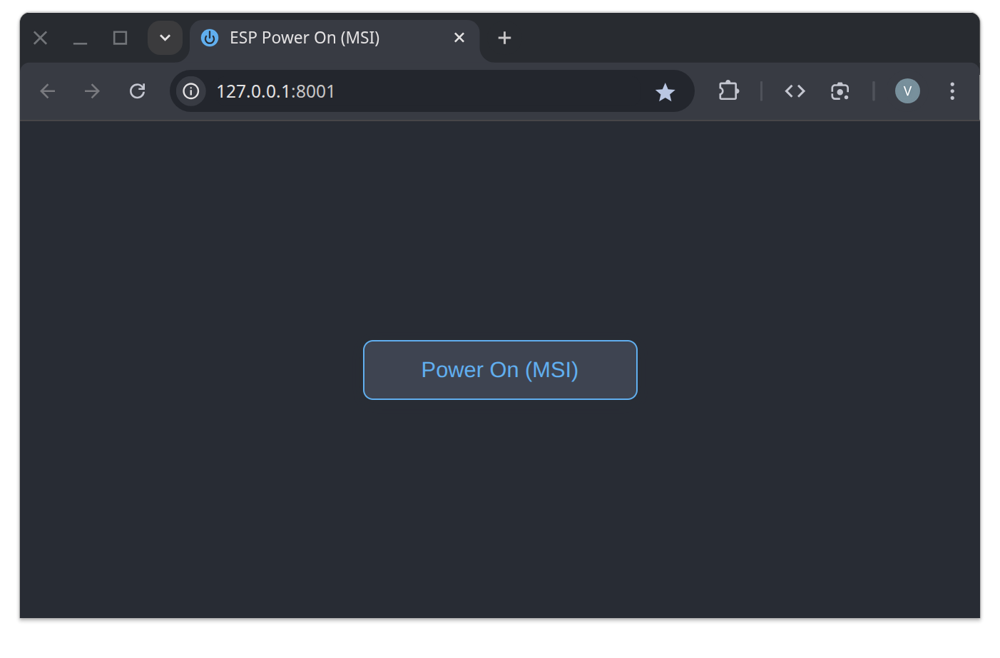

# ESP Power On



A web application for remotely powering on devices via ESP-based microcontrollers (such as ESP8266, ESP32) running ESP Easy firmware or any compatible firmware supporting HTTP GPIO control commands. The project is designed for remote powering on a PC or other equipment using a web interface.

---

## How It Works

- The application launches a web server with a "Power On" button.
- When the button is pressed, an HTTP request is sent to the microcontroller, which sends a pulse to the selected GPIO.
- The microcontroller's GPIO is connected to an optocoupler (e.g., PC817C) through a 330 Ohm resistor.
- The output of the optocoupler is connected in parallel to the power button on the motherboard.
- A pulse on the GPIO closes the power button circuit, which is equivalent to pressing the button manually.

---

## Wiring Diagram

```
[ESP GPIO] ---[330 Ohm]---[PC817C Optocoupler Input]
[PC817C Optocoupler Output] ---||--- [Motherboard Power Button]
```

- The microcontroller's GPIO is connected to the optocoupler input through a 330 Ohm resistor.
- The optocoupler output is connected in parallel to the standard power button on the motherboard.
- When a pulse is sent to the GPIO, the optocoupler closes the circuit, simulating a button press.

---

## Supported Devices

- ESP8266, ESP32, and other microcontrollers compatible with [ESP Easy](https://www.letscontrolit.com/wiki/index.php/ESPEasy) firmware.

---

## Environment Variables

| Variable        | Required | Description                                    | Example Value        |
|-----------------|:--------:|------------------------------------------------|----------------------|
| `ESP_ADDRESS`   |   Yes    | IP address or hostname of the microcontroller  | `192.168.1.42`       |
| `ESP_GPIO_NUM`  |   Yes    | GPIO number to be pulsed                       | `16`                 |
| `APP_PORT`      |   No     | Web server port (default: `8080`)              | `8080`               |
| `DEVICE_NAME`   |   No     | Device name for UI display                     | `PC`                 |
